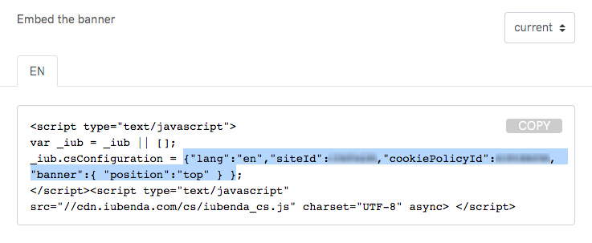

# gatsby-plugin-iubenda-cookie-footer
Easily add the Iubenda's cookie policy banner to your Gatsby site. Optionally, it integrates the
Iubenda acceptance with Google Tag Manager.

[](http://commitizen.github.io/cz-cli/)
[](https://travis-ci.com/NoriSte/gatsby-plugin-iubenda-cookie-footer)
[](https://github.com/ellerbrock/open-source-badge/)

## Install

`npm install --save gatsby-plugin-iubenda-cookie-footer`

## What this plugin does

- it adds the Iubenda cookie footer
- (optional) it integrates the Iubenda's acceptance with Google Tag Manager, that means:
  - it pushes the `iubenda_consent_given` event to the Google Tag Manager (GTM) data layer
  - it pushes the `iubenda_consent_given` event to the GTM data layer when the user navigates to the
    different routes
  - it allows you to customize both the GTM event pushed and the GTM data layer name

#### What this plugin does not

- it doesn't add the Google Tag Manager script (see the
  [gatsby-plugin-google-tagmanager](https://www.gatsbyjs.org/packages/gatsby-plugin-google-tagmanager/)
  for that)

## How to use

### Basic usage

```javascript
// In your gatsby-config.js
plugins: [
  {
    resolve: 'gatsby-plugin-iubenda-cookie-footer',
    options: {
      iubendaOptions: {"lang":"en","siteId":XXXXX,"cookiePolicyId":YYYYY, /* ... */ },
    }
  }
]
```

You can copy/paste the `iubendaOptions` from the Iubenda embed script



### Usage with Google Tag Manager

```javascript
// In your gatsby-config.js
plugins: [
  {
    resolve: 'gatsby-plugin-iubenda-cookie-footer',
    options: {
    iubendaOptions: {"lang":"en","siteId":XXXXX,"cookiePolicyId":YYYYY, /* ... */ },
    // optional, if present, a Google Tag Manager event ("iubenda_consent_given") is triggered
    googleTagManagerOptions: true
  }
]
```

The user acceptance is pushed to the GTM data layers as explained [by the official Iubenda guide](https://www.iubenda.com/en/help/1235-how-to-use-google-tag-manager-to-simplify-the-adoption-of-cookie-law-requirements).

### Usage with Google Tag Manager and custom event/dataLayer name

```javascript
// In your gatsby-config.js
plugins: [
  {
    resolve: 'gatsby-plugin-iubenda-cookie-footer',
    options: {
    iubendaOptions: {"lang":"en","siteId":XXXXX,"cookiePolicyId":YYYYY, /* ... */ },
    // optional, if present, the Google Tag Manager callback is added
    googleTagManagerOptions: {
        // optional, default to "iubenda_consent_given"
        eventName: "custom_iubenda_event_name",
        // optional, default to "dataLayer"
        dataLayerName: "customDataLayerName"
    }
  }
]
```
